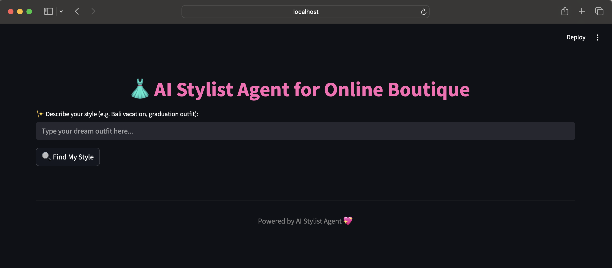
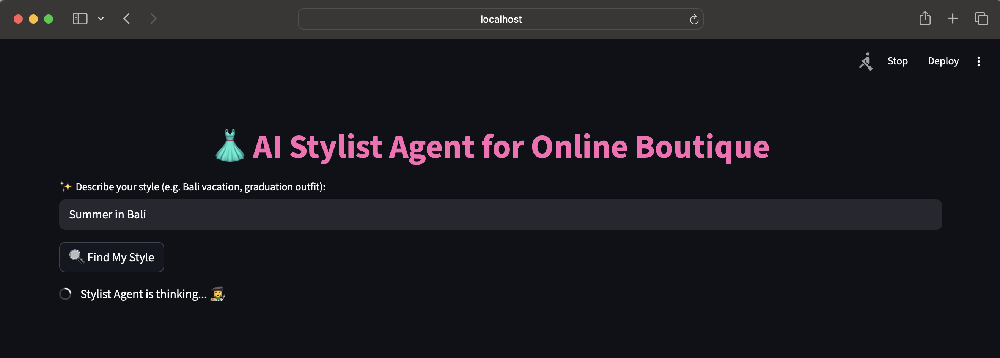
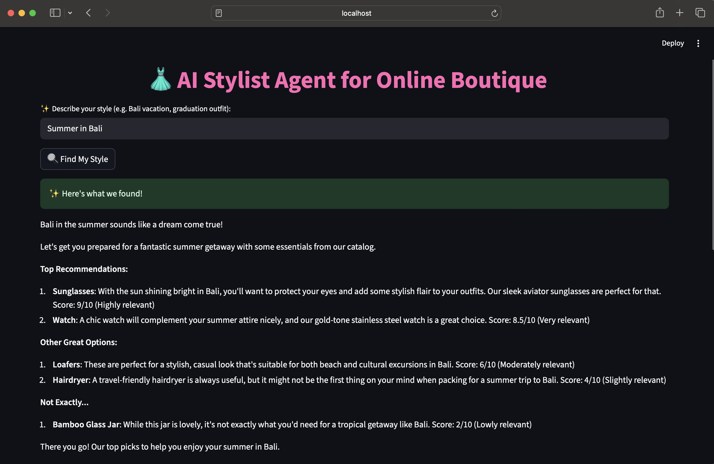

# AI-Stylish Fashion Agent

An intelligent fashion recommendation system that enhances the Google Online Boutique microservices application with an AI-powered stylist. This agent provides personalized outfit recommendations based on mood, vibe, or occasion rather than just product keywords.


## Features

- **Intelligent Recommendations**: Get outfit **suggestions based on descriptive queries of your feel** like "Miami summer", "Beach wedding", or "Casual Friday"
- **Dual AI Support (Temp feature)**: Choose between local (Ollama) or cloud-based (Gemini) embedding providers
- **Vector Search**: Leverages Pinecone for efficient semantic product search
- **gRPC Integration**: Seamlessly connects with the existing Google Online Boutique microservices
- **Modern Web Interface**: Beautiful Streamlit-based frontend (Temp for MVP) for easy interaction
- **Dockerized Microservices**: Independent containers for ragagent (backend) and frontend.


## Architecture

```
┌───────────────────┐      ┌────────────────────────┐      ┌───────────────────┐
│   Frontend (UI)   │      │   AI Agent Service     │      │   Vector Database  │
│   Streamlit :8501 │<────>│   FastAPI (RAG System) │<────>│   Pinecone Index   │
└───────────────────┘      └────────────────────────┘      └───────────────────┘
                                                               │
                                                               v
                                                     ┌───────────────────┐
                                                     │  gRPC Product API │
                                                     │ (Online Boutique) │
                                                     └───────────────────┘

```

## Screenshots



### RAG Agent Service Flow


### End-to-End System


## Project Structure

```
AI-Stylish-fashion-agent/
├── Agent/                   # AI Agent (FastAPI microservice)
│   ├── ragAgent_service.py   # RAG system - API server
│   └── Dockerfile           # Container setup for agent
├── DBfile/                  # Database + gRPC components
│   ├── db.py
│   ├── demo_pb2.py
│   └── demo_pb2_grpc.py
├── Frontend/                # Web interface (Streamlit)
│   ├── app.py
│   └── Dockerfile
├── requirements.txt         # Shared dependencies
├── docker-compose.yaml      # Compose setup (Frontend + Agent)
├── .env_template            # Environment variable template
└── README.md                # Documentation

```

## Quick Start

### Prerequisites

- Python 3.10+
- Docker & Docker compose
- Pinecone account
- Ollama (for local embeddings) OR Google AI API key (for cloud embeddings)

### Installation

1. **Clone the repository**
   ```bash
   git clone <repository-url>
   cd AI-Stylish-fashion-agent
   ```

2. **Install dependencies**
   ```bash
   pip install -r requirements.txt
   ```

3. **Set up environment variables**
   Create a `.env` file in the root directory:
   ```env
   # Pinecone Configuration
   PINECONE_API_KEY=your_pinecone_api_key
   PINECONE_ENVIRONMENT=your_pinecone_environment

   ...
   
   # Google AI (if using Gemini)
   GEMINI_API_KEY=your_gemini_api_key
   ```

4. **Set up Pinecone**
   - Create a Pinecone account at [pinecone.io](https://pinecone.io)
   - Create an index named `online-boutique-products`
   - Note your API key and environment

5. **Choose your embedding provider**

   **Option A: Ollama (Local)**
   ```bash
   # Install Ollama
   curl -fsSL https://ollama.ai/install.sh | sh
   
   # Pull the embedding model
   ollama pull nomic-embed-text
   ollama pull llama3.2:latest 
   ```

   **Option B: Gemini (Cloud)**
   - Get your API key from [Google AI Studio](https://aistudio.google.com/)
   - Add it to your `.env` file

6. **Run with Docker Compose**
   ```bash
   docker-compose up --build
   ```
  - Frontend → http://localhost:8501
  - Backend (RAG Agent) → http://localhost:8000/docs
<!-- 
### Running the Application

1. **Start the Google Online Boutique services**
   ```bash
   # Clone and run the microservices demo
   git clone https://github.com/GoogleCloudPlatform/microservices-demo.git
   cd microservices-demo
   ./scripts/start.sh
   ```

2. **Populate the database**
   ```bash
   python DBfile/db.py
   ```

3. **Run the AI Agent**
   ```bash
   # For interactive CLI version
   python Agent/ragv3.py
   
   # For web interface
   streamlit run Frontend/app.py
   ```

## 🎯 Usage

### Command Line Interface

Run the agent and describe what you're looking for:

```bash
python Agent/ragv3.py
```

Example interactions:
- "I need something for a Miami summer vacation"
- "What should I wear to a beach wedding?"
- "Looking for a casual Friday outfit"
- "I want something elegant for a dinner date"

### Web Interface

Access the beautiful web interface at `http://localhost:8501`:

1. Open your browser
2. Navigate to the Streamlit app
3. Enter your style description
4. Click "Find My Style" for recommendations

## 🔧 Configuration

### Embedding Providers

**Ollama (Recommended for local development)**
- Pros: Free, runs locally, no API limits
- Cons: Requires local setup, uses more resources

**Gemini (Recommended for production)**
- Pros: Cloud-based, high-quality embeddings, easy setup
- Cons: Requires API key, has usage limits

### Pinecone Configuration

The system uses Pinecone for vector storage and retrieval. Configure your index with:
- **Index Name**: `online-boutique-products`
- **Metric**: `cosine`
- **Dimension**: Automatically detected based on embedding model

## 🛠️ Development

### Adding New Features

1. **New Recommendation Logic**: Modify the `recommend_products()` function in the Agent files
2. **UI Improvements**: Update the Streamlit app in `Frontend/app.py`
3. **Database Schema**: Modify the gRPC protobuf definitions and regenerate

### Testing

```bash
# Test the RAG system
python Agent/ragv3.py

# Test the web interface
streamlit run Frontend/app.py
```

## 📊 Performance

- **Query Response Time**: < 2 seconds for most queries
- **Embedding Generation**: ~500ms (Ollama) / ~200ms (Gemini)
- **Vector Search**: ~100ms average
- **Recommendation Generation**: ~1-3 seconds depending on model

## 🤝 Contributing

1. Fork the repository
2. Create a feature branch (`git checkout -b feature/amazing-feature`)
3. Commit your changes (`git commit -m 'Add some amazing feature'`)
4. Push to the branch (`git push origin feature/amazing-feature`)
5. Open a Pull Request

## 📝 License

This project is licensed under the MIT License - see the [LICENSE](LICENSE) file for details.

## 🙏 Acknowledgments

- [Google Cloud Platform](https://cloud.google.com/) for the microservices demo
- [Pinecone](https://pinecone.io/) for vector database services
- [Ollama](https://ollama.ai/) for local AI model hosting
- [Streamlit](https://streamlit.io/) for the web interface

## 📞 Support

If you encounter any issues or have questions:

1. Check the [Issues](https://github.com/your-repo/issues) page
2. Create a new issue with detailed information
3. Contact the development team

---

**Happy Styling! 👗✨** -->

